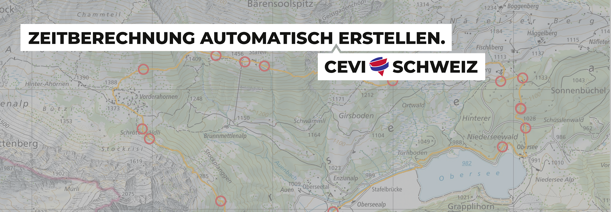

# Automatic Walk Time Tables

The aim of this project is to automate and speed up the process of creating a J+S walk-time table for a hike or bike
tour. There are already some tools that provide valuable support for planning. Nevertheless, they are not suitable for
planning a hike with larger groups, such as in a J+S-camp.



The goal of this project is to provide a tool that is suitable for planning hikes with larger groups. This is realised
with an interactive map that allows to plan a route and to adjust the walk-time table accordingly. All based on an easy
to user web interface.

In the end the user should be able to create a walk-time table for a hike with a few clicks and export it as a PDF as
well as an Excel file containing the walk-time table based on the J+S template.

**Important:** Manual planning remains a fundamental part of preparing for a hike. This project only aims to speed up
mechanical, repetitive processes like creating a walk-time table based on an existing route. This programm is no
substitute for careful planning.

## Run it Locally and Start Developing

As of [version 2.0.0](/changelog/changelog#version-2-0-0), the application is split into multiple parts, each living in
its separate docker container. You can launch the application as a bundle using the following command:

::: warning
For all commands in the documentation, we are assuming you're running Linux (Mac or WSL should work as well).
:::

```bash
docker-compose up [--build]
```

::: info
`--build` is optional and forces docker to rebuild the containers.

By default, the application is served locally. It will rebuild/reload the container automatically if you make changes to
the code (except for configuration files, e.g. `docker-compose.yml`, `package.json`, etc.).
:::
